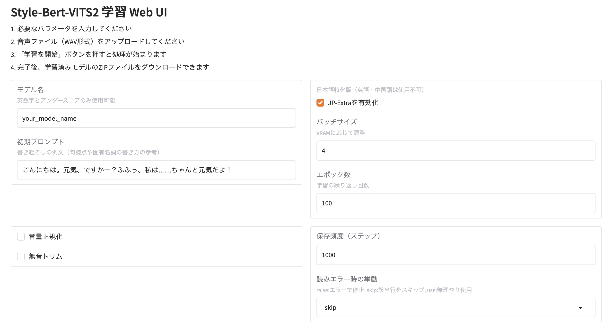

# style-bert-vits2-colab-lite

[日本語はこちら](./README_ja.md)

Minimal Google Colab notebook for [Style-Bert-VITS2](https://github.com/litagin02/Style-Bert-VITS2) voice synthesis.  
Run it in your browser—no local setup required.

[](https://colab.research.google.com/github/shinshin86/style-bert-vits2-colab-lite/blob/main/colab.ipynb)

## Quick Start
1. Click the **"Open in Colab"** badge above (or open `colab.ipynb` directly on Colab).  
2. For detailed usage instructions, please read the Colab notebook (instructions are in Japanese).

## Requirements
- Google Account with Colab access  

## Web UI Version



You can run the Web UI version by copying and pasting the following commands into a Google Colab code cell:

```
#@markdown # style-bert-vits2-colab-lite Web UI Version
#@markdown Run this code cell to launch a Web UI where you can perform voice training through a GUI interface.
# ==== 1) Clone repository & prepare environment =============================
!git clone https://github.com/litagin02/Style-Bert-VITS2.git
%cd /content/Style-Bert-VITS2/

# Install required libraries
!pip install -r requirements-colab.txt --timeout 120

# Initialize without downloading default models
!python initialize.py --skip_default_models

# ==== 2) Download webui.py ===============================================
!curl -L https://raw.githubusercontent.com/shinshin86/style-bert-vits2-colab-lite/refs/heads/main/webui.py -o webui.py

# ==== 3) Launch Gradio UI ============================================
!python webui.py --share   # Remove --share to run with local URL only
```

### Usage
Once the Web UI is launched, configure the parameters (default settings work fine), upload your audio files for training, and click the "Start Training" button to begin the training process.

After training completes, you can download a ZIP file containing the following files:

* config.json
* style_vectors.npy
* {your_model_name}_e100_s300.onnx
* {your_model_name}_e100_s300.safetensors

## License
This repository follows [the original Style-Bert-VITS2 license (AGPL-3.0, LGPL-3.0)](https://github.com/litagin02/Style-Bert-VITS2).  
See the upstream project for details.