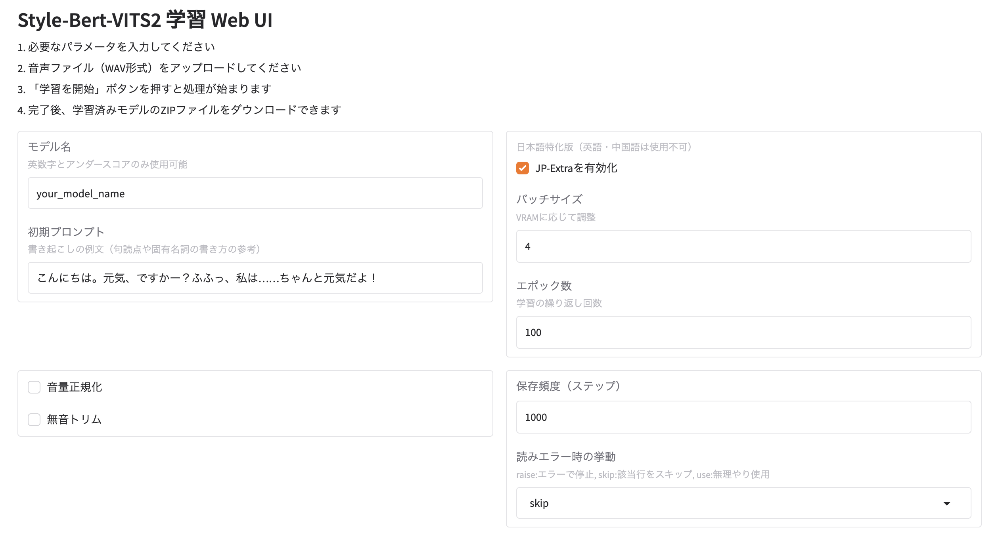

# style-bert-vits2-colab-lite

[Style-Bert-VITS2](https://github.com/litagin02/Style-Bert-VITS2) をブラウザ上だけで動かせる最小構成の Google Colab ノートブックです。  
ローカル環境のセットアップは不要です。

[](https://colab.research.google.com/github/shinshin86/style-bert-vits2-colab-lite/blob/main/colab.ipynb)

## はじめかた
1. 上の **“Open in Colab”** バッジをクリック（または `colab.ipynb` を Colab で直接開く）。  
2. 実際の利用方法はColabノートブックを読んでください（日本語）

## 必要なもの
- Colab を利用できる Google アカウント

## Web UI版



以下のコマンドをGoogle Colabのコードセルにコピー&ペーストして実行することでWeb UI版を起動することが可能です。

```
#@markdown # style-bert-vits2-colab-lite Web UI版
#@markdown こちらのコードセルを実行することでWeb UIが起動してGUI上で声の学習処理が行えます。
# ==== 1) リポジトリ取得 & 環境準備 ==========================
!git clone https://github.com/litagin02/Style-Bert-VITS2.git
%cd /content/Style-Bert-VITS2/

# 必要ライブラリをインストール
!pip install -r requirements-colab.txt --timeout 120

# 既定モデルをダウンロードせず、初期化だけ行う
!python initialize.py --skip_default_models

# ==== 2) webui.py を配置 ====================================
!curl -L https://raw.githubusercontent.com/shinshin86/style-bert-vits2-colab-lite/refs/heads/main/webui.py -o webui.py

# ==== 3) Gradio UI を起動 ===================================
!python webui.py --share   # --share を外せばローカル URL だけで起動
```

### 使い方
Web UIを起動したら、パラメーターを設定の上（デフォルト設定のままでも可能です）、学習元の音声ファイルをアップロードしてから『学習を開始』ボタンを押して学習を開始してください。

学習が完了すると以下のファイルがまとめられたZIPファイルをダウンロードすることが可能となります。

* config.json
* style_vectors.npy
* {設定したモデル名}_e100_s300.onnx
* {設定したモデル名}_e100_s300.safetensors

## ライセンス
本リポジトリは[元プロジェクトのライセンス（AGPL-3.0, LGPL-3.0）](https://github.com/litagin02/Style-Bert-VITS2)に従います。  
詳細はオリジナルの Style-Bert-VITS2 を参照してください。
